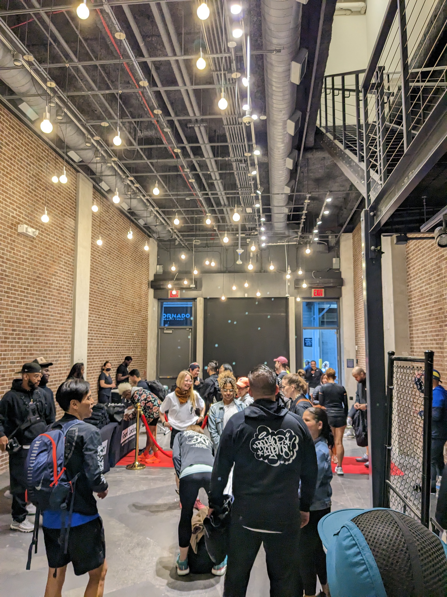
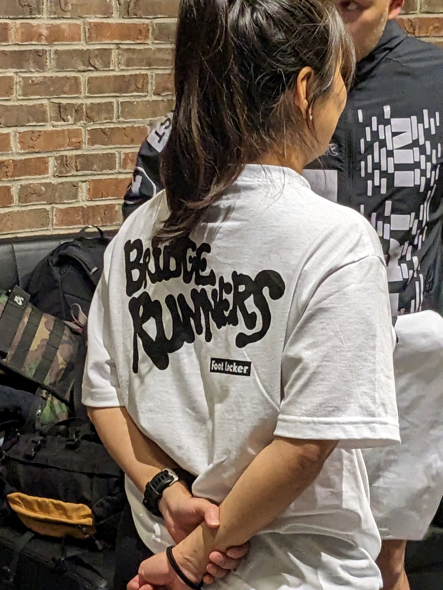
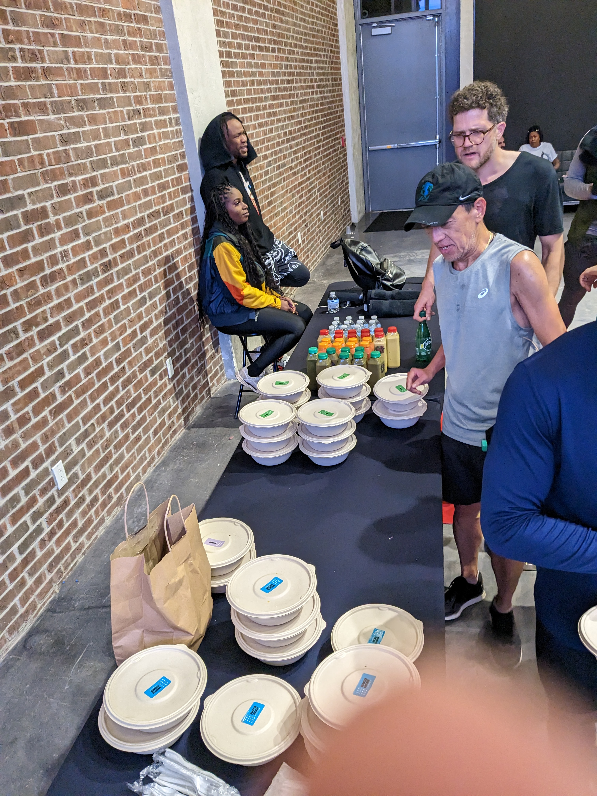
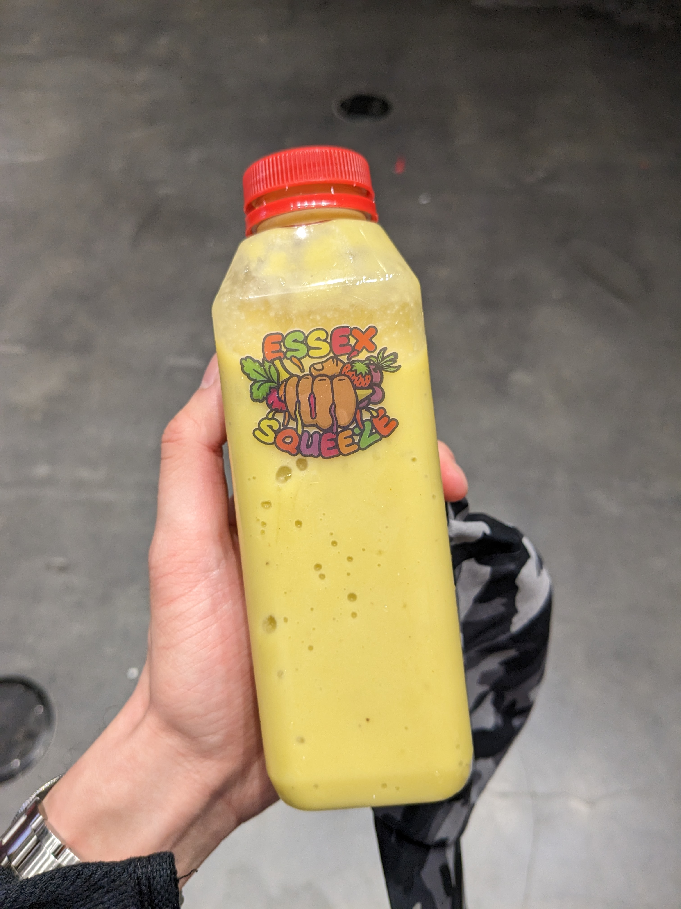

This is my post-event write-up for the Bridgerunners 20th year run with Foot Locker event that I attended yesterday (Wednesday 04/26 @ 7 PM).

IG: https://www.instagram.com/bridgerunners/

## The deets:
The meet location is very low-key. It's essentially a loading dock / garage with a side door entrance. So on the outside it looks like a garage with a rolling shutter and the only way for you to tell that it wasn't was a very subtlety stamped logo on the garage door wall. 

Walking inside, you will find some variation of a Footlocker pop up space. The interior and aesthetics give off gym vibes with fences, benches, and various office supplies tucked inside rolling cabinets. There were free massage services as well as free merchandise. 

The freebies were first-come first-serve: A low thread count American Apparel printed shirt, blank black hand towel, and some bottled water.

They ran out of freebies to latecomers but not much in value was lost for the low thread count non-technical fabric shirt. But I was surprised that not many people showed up on the dot. I personally rolled in around five minutes before the start time on the flyer.  

They had some cool visuals to celebrate the anniversary, and a lot of folks pulled up. When the pep talk introduction was given, I then realized that the reason why people show up late was because the runs have always started at "7:30/ 8:00/ 8:30" 

## The run:
The run was fun, and there were enough points on the route for slower runners to catch up. Since the sun was down, there were fewer pedestrians and cars to dodge. 
The run snaked down escalator steps, onto oncoming tenth avenue traffic, up the stairs to the high line, pass the gates that prevented us from going any further because a pink tree art installation was being set up in progress, across the elevated pedestrian crossing to the Intrepid, to the grassy areas inside Central Park, and straight down the sixth avenue bike lane south. 

The run ended with high-fives, and light post run refreshments: boxed salad, bottle water, and Essex Squeeze smoothies. 

## Conclusion: 
This by far was one of my most fun run club runs that I've attended so far. I love running in the streets, the raw chaotic vibe of the route, and the cool opportunities to take photos. I will be back on Wednesdays (late) to run BRIDGE!!!