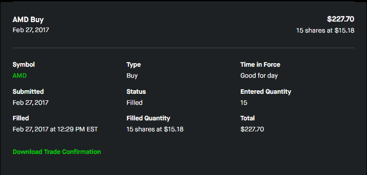

```
This post is a part of series of posts called "A Part of Me", or APoM for short.
It is meant to document my upbringing with various subjects that matter the most to me. 
These topics and hobbies define who I am to date, and subsequently have proven to stand the test of time. 
My experiences are eternalized here on my blog site until I do something else with them.
Perhaps video based supplements in the future. 

This is my second post of the series that focuses on finance.
```

## First contact - The Money-Savvy Grade Schooler
I had one of my cousins lived with me for a while after they graduated from University of Connecticut. They were new to the New York City and saved time, money and hassle of moving, by moving into my childhood home. This is important because through this cousin, I was had my first exposure to finance. My cousin explained how stocks were just parts of a company that you can own, and therefore be an owner of the company by holding fractional portions of them. This was an extremely difficult concept to wrap my head around, probably because I was a little older than ten years old at the time. Nonetheless, I attribute this core memory to my first exposure to finance. 

Fast-forward to present day, I don't work in the financial world. My exposure outside to finance aside from that time period where my cousin lived with me was going to a university with strong business programs. But how did I get into equities, exchange traded funds, fixed income bonds, and options? 

Well it is because of a small startup named RobinHood. 

## RobinHood - The Financial Frontier
RobinHood in 2017 was revolutionary. It was marketed as the first brokerage to not charge a commission fee for trades. Around this time period, I recall that paying $75 was the norm in some brokerages to place an order. The financial industry was moving towards the future of a low-cost anybody can do it type mentality. If you didn't have to pay a fee, more money stays in your pocket. You can trade more frequently, and more power to you.  
With the rise in funds that offer low expense ratios, brokerages that offer zero to little commissions, and the ability to easily buy fractional shares meant that broke college kids did not need to interact with someone at a trading desk to start buying stocks.

I was nineteen, starting my second semester freshmen year, and decided to buy 15 shares of AMD @ $15.18. A day later, I was buying `$JNUG`, a triple leverage gold mining exchange traded fund, because of something I read off of [/r/wallstreetbets](https://reddit.com/r/wallstreetbets). I had zero experience of trading stocks, and had no idea what a triple leveraged ETF was, but thanks to RobinHood, I was trading with no fees. I was referring friends to the platform, and earning sign-up bonuses for every friend I referred. One of the free stocks that I received from referring my first friends was `$CHK`. 

Looking back with a tinted lens, my biggest blunders that I regret was selling. I sold `$AMD` at a lost, I sold `$CHK` for a handful of dollars, and I was paper-handing `Netflix` because the stock price wasn't projecting upwards. 



## Stockpile - Sidetracked
This was an interesting platform. Where you could buy units of stock for one dollar. I don't really recall how I joined Stockpile, but it must've been some kind of promotion where you got some free credits that you could redeem for units of stocks. 

Records show that my earliest transaction on RobinHood was recorded on `December 18, 2017` and I didn't leave until `Jul 13, 2019`. 

## The Vanguard Money Tree
I joined Vanguard because of their low expense ratio ETFs (this was before the introduction of Fidelity's FZROX zero expense ratio ETFs and similar zero expense funds). I had this Boglehead Morningstar "Stay the Course" mentality and realized that this was the perfect place to park my self-managed Roth IRA. I dissuaded my peers from onboarding onto the platform because I knew that the user interface is bad. 

Records show that I signed up on `10/23/2017` and bought my first share of `$VTI` the next day later. 

## Fidelity Fanatic
I made the jump from RobinHood because of the January 2021 Scandal in which it prevented users on its platform from trading certain Stocks when they were being short squeezed. A great exodus was called by retail investors on message boards where I departed from RobinHood to Fidelity where I remain today. I'm thankful that the brokerage provides no cost commissions for regular trades and has actual customer support. Options trading is fairly standard compared to other brokerages. Direct registering a particular brick and mortar retailer was very effortless. Though I'm a little annoyed that margin is something that just comes attached to the platform and oftentimes than not, I will place a trade, and it will execute, and I realize that the position that I bought used margin instead of cash. I wish that the platform could tell me my unrealized gains and losses better and would stop updating the user interface every six months. 

Records show that I funded my account on `01/08/2021` and bought shares in `$ARKK` and `$TAN`.