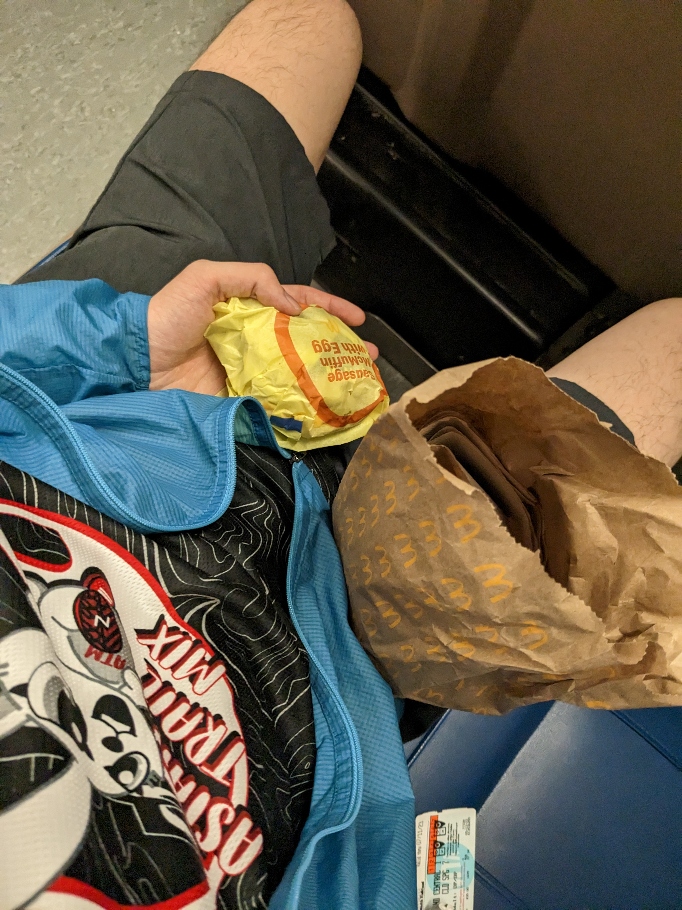
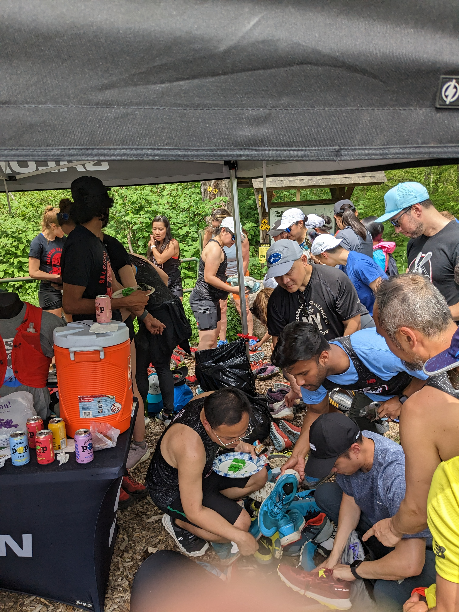

## Introduction - Pre Run
I attended the Asian Trail Mix - One Year Birthday & AAPI Heritage Month Trail Clinic on Saturday, May 13, 2023. It was my second ATM event, the first being the 2023 January Lunar New Year run at Central Park's Bridle Path and Reservoir Loop (back then I could barely run a 5K without stopping or walking). The event took place at the Undercliff Trailhead in Cold Spring, and was supported by Salomon, Culture Pop, Super Goop, and Planters. The event start was accessible via the Metro North Railroad and then a short walk to the trail head. Many individuals either got on the train at Grand Central Terminal or at Harlem 125th Street, or drove. This wasn't the first time Salomon hosted a trail clinic for Asian Trail Mix, for many people attended the previous one. 

The Salomon tent had demo shoes to try for the duration of the event, a water cooler, and also a water-soluble drink mix. The demo shoe was the Salomon Sense Ride 5 Trail-Running Shoe in the Rainy Day/Hot Sauce/Freesia colorway. This was my first time trying out Salomon shoes, trail running shoes for that matter. They fit true-to-size, had a cool feature where there was a "lace garage" in the shoe's tongue to pack the excess lace away. The shoes felt good to run in, but I noticed that as my foot got more acclimated to the shoe, I had to readjust and tighten the lace string to ensure optimal wear. The shoes performed exceptionally well for trail running and maneuvers on technical terrain. I learned that I was more of a fan of the cushioned feel because of the other shoes in my running shoe collection, because the Sense Ride 5 definitely let you know that you were running on a trail for sure.   

## The Trail Run
I want to start off and say that I was definitely not prepared to run. Due to the uncertainty of bathrooms in the area, I didn't pack any hydration or bottles with me. I didn't put any sunscreen on thinking that good tree coverage was a good substitute for sunscreen with SPF. Big mistake. The day was hot, and there was a high probability that if you were a mouth breather like I was, you would be eating flies. For fuel, I had a Sausage McGriddle and a Sausage McMuffin and that was the only thing I ate before my run. Many individuals that showed up were caught off guard and many chose to walk instead of run because of the heat and conditions. I stepped in the same stream crossing twice, once going and once coming back, and although the shoes could only handle so much, my Darn Tough hiker socks made sure I wasn't sponging around for too long. 

## Post Run - Ammenities
After the trail run, I essentially had my first thirst quencher of the day: a [Culture Pop Lemon Lime Soda](https://drinkculturepop.com/products/lemon-lime-cardamom). It was refreshing with probiotics and went down like a yeasty kombucha. Drink cans were limited, so a cool idea that I had was to reuse the metal can and fill it with water from the cooler that the Salomon guys brought. 

A salmon rice ball from Harper's Bread House (Chinatown!) is always on point. It was entertaining to watch other attendees struggle with opening their rice balls, and I was happy to help out salvage what they were holding.  Finally, some cake was cut to commemorate the birthday of Asian Trail Mix, although I did not partake. At the end of the event, there were apparel raffles (On Running) and shoe raffles (Fleet Feet) as well as a shoe giveaway from gently used stock that Salomon brought. I wasn't interested, but I regretted not pouncing with the rest of the crowd because I believe the models were Speedcrosses. Unfortunately the county was not playing nice with the Planters NutMobile. I overheard that it got pulled over on its way to the trailhead because commercial vehicles aren't allowed on the parkways. In addition, it wasn't allowed to stay and hang out near the trail head because the local officials didn't allow commercial vehicles to be parked on public streets. 

## Heading Home
Walking back the town of Nelsonville and cold spring are very nice. Definitely a good amount drivers on the main street road. From walking back to the cold spring train station after the conclusion of the event, I met Max that runs with Woodside Sunnyside Runners, and Jaime who leads Run For Chinatown! In the little tunnel walkway that allows you to get from station platform to the next, there were these two kids that were trading Pokémon cards with each other. Binders (and hopefully sleeves) and all. 

## Final thoughts
Next time, I'm bringing sun protection, a reusable bottle, and pre run/ run / post-run snacks. Plus more planning on what to eat before the run and see what shops and stores are in the area. I spent $4 for a Tropicana half-and-half with ice, and my newly minted friend max spent $8 for a Tropicana ice tea with ice cubes and a black and white cookie. 
