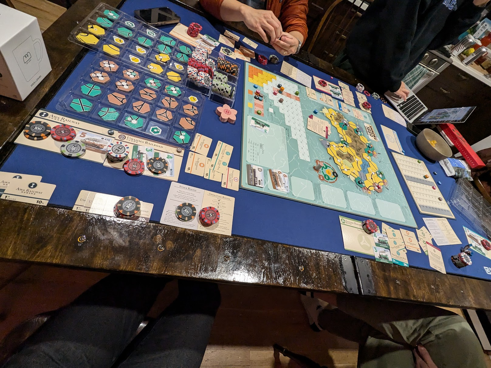
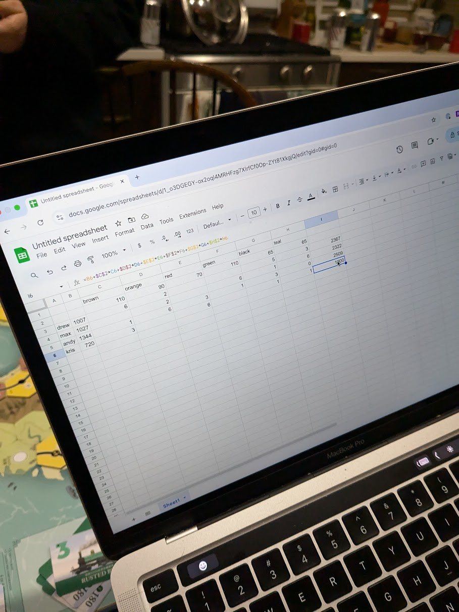

> 2024 was an underrated year for board games. I did not have the opportunity to play many of the games that live on my shelf, but I was able to play many new games through attending gaming conventions and hanging out with friends. This initial brain dump of Shikoku 1889 details my initial thoughts on my first ever 18xx game. 

## What is Shikoku 1889?
Shikoku 1889 is a reprint of a beloved 18xx classic titled "1889: History of Shikoku Railways". It is widely touted as the gateway game into the 18xx board game genre. The term "18xx" does not refer to any adult themes, but rather is a generic term for a series of games that recreate the building of railroad corporations during the 19th century. In Shikoku 1889, you play as companies that own and operate railway corporations on the Japanese island of Shikoku. Every round consists of stock rounds, where players use money to buy shares in railroad companies, and operating rounds, where players that are designated as the major shareholder of a corporation make decisions for the corporation on the game board.

## Pre-play thoughts and preparations
I read the rule book for the game a couple of days before I was scheduled to play it at a friend's house. I understood the gist of what the game was about (this was my first game in the 18xx space), but had no sense of what the game was actually like outside the rule book. The only YouTube video that I watched was the review from Shut Up & Sit Down approximately 30 minutes before I started playing. This cleared up a lot of things about the game for me inside my head.



## In Game thoughts and experience
I played Shikoku 1889 with 3 other players that had never played the game before. But, they came to the table with more knowledge about the game, for it was theirs. The first stock round was very ambiguous. We went multiple rounds around the table not quite sure what we were doing with these railroad corporations, stock certificates, and piles of poker chip money. When we eventually got the gist of what stock rounds and operating rounds were supposed to play like, it all clicked. After that, it was just optimizing like a business in real life: How can I make the most money and increase my corporation's share price, so I can make even more money? We played our first game like very close neighbors. Many players were financially invested in all the other players and thus everyone was happy. This down the line meant that things like determining who was ahead became tricky. 

## Things that caused us confusion as new players
- Private companies - we weren't sure how to evaluate the power levels of the private companies that we were dealt at the start of the game. There were some obvious advantages to some of them, but we determined that the unique abilities were tepid at best.
- Station tokens - The seemingly broken ability for players to completely block a player's corporation to score was pretty powerful. Much more powerful than we expected as the game progressed.
- Tile upgrades - It was all fun and games until we realized that we spent some of the more niche tiles in less than optimal places with no turning back. 
- Ownership of multiple railroad companies - It took us a while to figure that we would eventually need to operate more than one company to break the bank and progress the game state.
- The game is scored based on how much money in forms of stock shares and money each player has at the end of the game. Not including the railroad companies that they control.

## Things I would do differently next play through
- Play more offensively. If the tile upgrade was free, why not upgrade to a shittier tile to prevent the expansion of other railroad companies.
- Be more protective of the tiles that my corporations have and try to segment the tiles that I occupy from others.
- Do better math, I spent a lot of the turns that weren't mine thinking "If only I had $XX more money in my corporation to buy the next best train". Oftentimes I was about 10-40 yen away from my ideal purchase. 
