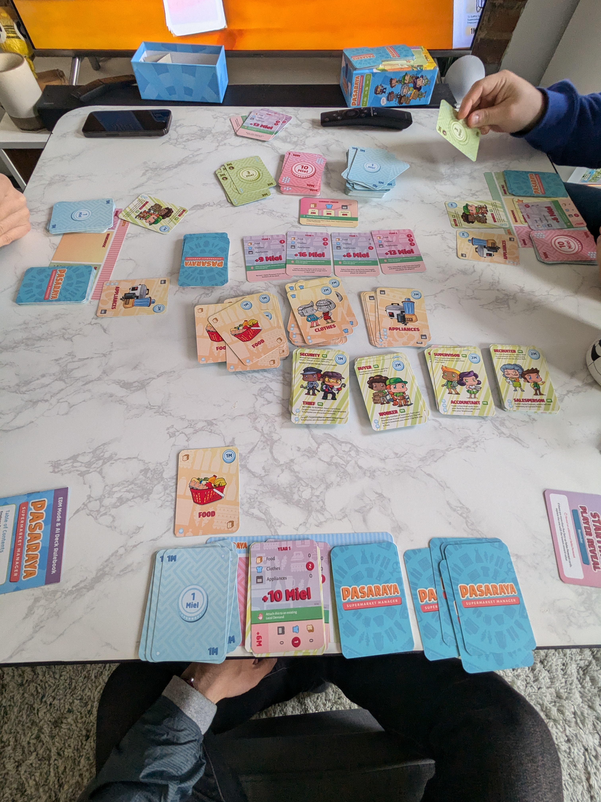

> Pasaraya: Supermarket Manager is a game that found its way onto one of my friends' board games shelves because it was given away to them from some other friends that bought the game and determined that it was too tough to learn. Upon initial inspection, the rule book was very disorganized, unclear, and my playgroup ended up piecing together multiple video reviews and walkthroughs to figure out what the real rules were.

## What is Pasaraya: Supermarket Manager?
Pasaraya: Supermarket Manager is a game designed and developed by a Malaysian board game designer called BoxFox Games. Players play as supermarket managers and build optimized decks filled with food, clothes, appliances, money, and employees from a shared center pool of piles of cards. Players attempt to fulfill order contracts and make the most amount of money with the least amount of employees to win when a previously allocated card is semi-randomly drawn.

## Pre-play thoughts and preparations
The choice to learn and play Pasaraya: Supermarket Manager was solely mine. I wanted to learn and play something new and Pasaraya was something that not even my other friends that owned the game knew how to play. We used the rule book to set up the game and realized that the rule book was fundamentally worthless because it was so disorganized. We resulted in using YouTube videos that were years old to figure out how to play and what the rules were.

## In-game thoughts and experience
Right off the bat, I could see that this game drew heavy influence from Dominion, but with supermarket elements. The game currency allows you to purchase more and more components from a central shared pool of piles of cards for your engine. 

## Things that caused confusion
- The component that caused the most confusion was the 10-coin card. We shuffled it into our warehouse without realizing that the card back was different from the rest. It was meant to represent more of 
- Some interactions of the employees were not clear when they interacted with cards on the table or in the deck. When an employee allowed you to purchase or acquire an item, it was not the most clear where did the item go: in your hand? In your supermarket? Or in your deck? 

## Things I would do differently next play through
- Be wary of the amount of appliances that you stock. You ideally don't want to leave them stocked in your supermarkets, because of the slight chance that they get yoinked by thieves from other players.
- Optimize my turns and deck a little better. You ideally want to build your deck to cycle between two different play styles: merchandise buying and contract redeeming. Stack your deck with money with the intent to purchase wares, then as your new deck of newly purchased wares, redeem those for contracts and cycle the money back into the deck when it is time to shuffle.  

## Would I play it again?
Sure, I'll try it again, but I think I would prefer Dominion over Pasaraya: Supermarket Manager for any subsequent games.

